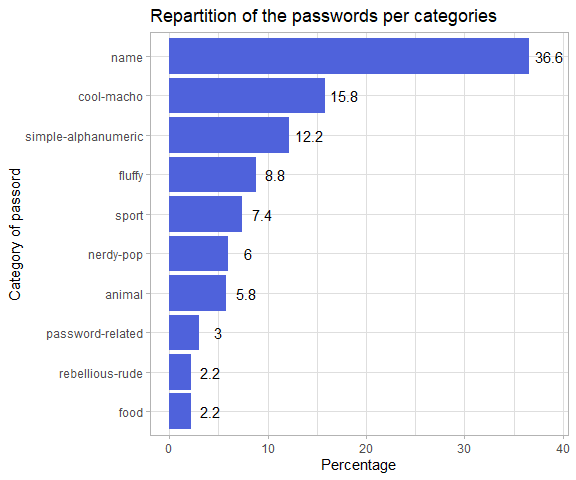

-   [Data import and inspection](#data-import-and-inspection)
-   [Quality check](#quality-check)
-   [Cleaning](#cleaning)
-   [Univariate study](#univariate-study)

    library(nd.tidytuesday)
    library(dplyr)
    library(ggplot2)

Data import and inspection
--------------------------

One can obtain the metadata table using `datapasta`’s R package addin
and copying the table available at

    meta <- data.frame(stringsAsFactors=FALSE,
                       variable = c("rank", "password", "category", "value", "time_unit",
                                    "offline_crack_sec", "rank_alt", "strength", "font_size"),
                       class = c("double", "character", "character", "double", "character",
                                 "double", "double", "double", "double"),
                       description = c("popularity in their database of released passwords",
                                       "Actual text of the password",
                                       "What category does the password fall in to?", "Time to crack by online guessing",
                                       "Time unit to match with value", "Time to crack offline in seconds",
                                       "Rank 2", "Strength = quality of password where 10 is highest,
                       1 is lowest,
                       please note that these are relative to these generally bad passwords", "Used to create the graphic for KIB")
    )
    meta <- as_tibble(meta)

    pander::pander(meta)

<table style="width:90%;">
<colgroup>
<col style="width: 27%" />
<col style="width: 16%" />
<col style="width: 45%" />
</colgroup>
<thead>
<tr class="header">
<th style="text-align: center;">variable</th>
<th style="text-align: center;">class</th>
<th style="text-align: center;">description</th>
</tr>
</thead>
<tbody>
<tr class="odd">
<td style="text-align: center;">rank</td>
<td style="text-align: center;">double</td>
<td style="text-align: center;">popularity in their database of released passwords</td>
</tr>
<tr class="even">
<td style="text-align: center;">password</td>
<td style="text-align: center;">character</td>
<td style="text-align: center;">Actual text of the password</td>
</tr>
<tr class="odd">
<td style="text-align: center;">category</td>
<td style="text-align: center;">character</td>
<td style="text-align: center;">What category does the password fall in to?</td>
</tr>
<tr class="even">
<td style="text-align: center;">value</td>
<td style="text-align: center;">double</td>
<td style="text-align: center;">Time to crack by online guessing</td>
</tr>
<tr class="odd">
<td style="text-align: center;">time_unit</td>
<td style="text-align: center;">character</td>
<td style="text-align: center;">Time unit to match with value</td>
</tr>
<tr class="even">
<td style="text-align: center;">offline_crack_sec</td>
<td style="text-align: center;">double</td>
<td style="text-align: center;">Time to crack offline in seconds</td>
</tr>
<tr class="odd">
<td style="text-align: center;">rank_alt</td>
<td style="text-align: center;">double</td>
<td style="text-align: center;">Rank 2</td>
</tr>
<tr class="even">
<td style="text-align: center;">strength</td>
<td style="text-align: center;">double</td>
<td style="text-align: center;">Strength = quality of password where 10 is highest, 1 is lowest, please note that these are relative to these generally bad passwords</td>
</tr>
<tr class="odd">
<td style="text-align: center;">font_size</td>
<td style="text-align: center;">double</td>
<td style="text-align: center;">Used to create the graphic for KIB</td>
</tr>
</tbody>
</table>

the `readr::read_csv` function gives some information on how the data
was processed, with here no errors or warnings.

    passwords <- readr::read_csv('https://raw.githubusercontent.com/rfordatascience/tidytuesday/master/data/2020/2020-01-14/passwords.csv')
    #> Parsed with column specification:
    #> cols(
    #>   rank = col_double(),
    #>   password = col_character(),
    #>   category = col_character(),
    #>   value = col_double(),
    #>   time_unit = col_character(),
    #>   offline_crack_sec = col_double(),
    #>   rank_alt = col_double(),
    #>   strength = col_double(),
    #>   font_size = col_double()
    #> )

The passwords dataset has 507 rows \* 9 variables. It is not tidy, if we
want to use the `value` variable of online guessing we need to add the
`time_unit` information to it.

    passwords %>% 
      glimpse()
    #> Observations: 507
    #> Variables: 9
    #> $ rank              <dbl> 1, 2, 3, 4, 5, 6, 7, 8, 9, 10, 11, 12, 13, 1...
    #> $ password          <chr> "password", "123456", "12345678", "1234", "q...
    #> $ category          <chr> "password-related", "simple-alphanumeric", "...
    #> $ value             <dbl> 6.91, 18.52, 1.29, 11.11, 3.72, 1.85, 3.72, ...
    #> $ time_unit         <chr> "years", "minutes", "days", "seconds", "days...
    #> $ offline_crack_sec <dbl> 2.17e+00, 1.11e-05, 1.11e-03, 1.11e-07, 3.21...
    #> $ rank_alt          <dbl> 1, 2, 3, 4, 5, 6, 7, 8, 9, 10, 11, 12, 13, 1...
    #> $ strength          <dbl> 8, 4, 4, 4, 8, 4, 8, 4, 7, 8, 8, 1, 32, 9, 9...
    #> $ font_size         <dbl> 11, 8, 8, 8, 11, 8, 11, 8, 11, 11, 11, 4, 23...

Glimpse of the passwords :

    passwords %>% head() %>% pander::pander()

<table>
<caption>Table continues below</caption>
<colgroup>
<col style="width: 8%" />
<col style="width: 13%" />
<col style="width: 27%" />
<col style="width: 10%" />
<col style="width: 15%" />
<col style="width: 25%" />
</colgroup>
<thead>
<tr class="header">
<th style="text-align: center;">rank</th>
<th style="text-align: center;">password</th>
<th style="text-align: center;">category</th>
<th style="text-align: center;">value</th>
<th style="text-align: center;">time_unit</th>
<th style="text-align: center;">offline_crack_sec</th>
</tr>
</thead>
<tbody>
<tr class="odd">
<td style="text-align: center;">1</td>
<td style="text-align: center;">password</td>
<td style="text-align: center;">password-related</td>
<td style="text-align: center;">6.91</td>
<td style="text-align: center;">years</td>
<td style="text-align: center;">2.17</td>
</tr>
<tr class="even">
<td style="text-align: center;">2</td>
<td style="text-align: center;">123456</td>
<td style="text-align: center;">simple-alphanumeric</td>
<td style="text-align: center;">18.52</td>
<td style="text-align: center;">minutes</td>
<td style="text-align: center;">1.11e-05</td>
</tr>
<tr class="odd">
<td style="text-align: center;">3</td>
<td style="text-align: center;">12345678</td>
<td style="text-align: center;">simple-alphanumeric</td>
<td style="text-align: center;">1.29</td>
<td style="text-align: center;">days</td>
<td style="text-align: center;">0.00111</td>
</tr>
<tr class="even">
<td style="text-align: center;">4</td>
<td style="text-align: center;">1234</td>
<td style="text-align: center;">simple-alphanumeric</td>
<td style="text-align: center;">11.11</td>
<td style="text-align: center;">seconds</td>
<td style="text-align: center;">1.11e-07</td>
</tr>
<tr class="odd">
<td style="text-align: center;">5</td>
<td style="text-align: center;">qwerty</td>
<td style="text-align: center;">simple-alphanumeric</td>
<td style="text-align: center;">3.72</td>
<td style="text-align: center;">days</td>
<td style="text-align: center;">0.00321</td>
</tr>
<tr class="even">
<td style="text-align: center;">6</td>
<td style="text-align: center;">12345</td>
<td style="text-align: center;">simple-alphanumeric</td>
<td style="text-align: center;">1.85</td>
<td style="text-align: center;">minutes</td>
<td style="text-align: center;">1.11e-06</td>
</tr>
</tbody>
</table>

<table style="width:47%;">
<colgroup>
<col style="width: 15%" />
<col style="width: 15%" />
<col style="width: 16%" />
</colgroup>
<thead>
<tr class="header">
<th style="text-align: center;">rank_alt</th>
<th style="text-align: center;">strength</th>
<th style="text-align: center;">font_size</th>
</tr>
</thead>
<tbody>
<tr class="odd">
<td style="text-align: center;">1</td>
<td style="text-align: center;">8</td>
<td style="text-align: center;">11</td>
</tr>
<tr class="even">
<td style="text-align: center;">2</td>
<td style="text-align: center;">4</td>
<td style="text-align: center;">8</td>
</tr>
<tr class="odd">
<td style="text-align: center;">3</td>
<td style="text-align: center;">4</td>
<td style="text-align: center;">8</td>
</tr>
<tr class="even">
<td style="text-align: center;">4</td>
<td style="text-align: center;">4</td>
<td style="text-align: center;">8</td>
</tr>
<tr class="odd">
<td style="text-align: center;">5</td>
<td style="text-align: center;">8</td>
<td style="text-align: center;">11</td>
</tr>
<tr class="even">
<td style="text-align: center;">6</td>
<td style="text-align: center;">4</td>
<td style="text-align: center;">8</td>
</tr>
</tbody>
</table>

Quality check
-------------

    # --- using base R function
    # passwords %>% 
    #   qual_fun(.)

    # --- tidyverse approach
    passwords %>% 
      tidy_qual() %>% 
      pander::pander()

<table style="width:100%;">
<caption>Table continues below</caption>
<colgroup>
<col style="width: 10%" />
<col style="width: 9%" />
<col style="width: 14%" />
<col style="width: 14%" />
<col style="width: 10%" />
<col style="width: 15%" />
<col style="width: 25%" />
</colgroup>
<thead>
<tr class="header">
<th style="text-align: center;">indic</th>
<th style="text-align: center;">rank</th>
<th style="text-align: center;">password</th>
<th style="text-align: center;">category</th>
<th style="text-align: center;">value</th>
<th style="text-align: center;">time_unit</th>
<th style="text-align: center;">offline_crack_sec</th>
</tr>
</thead>
<tbody>
<tr class="odd">
<td style="text-align: center;">n_na</td>
<td style="text-align: center;">7</td>
<td style="text-align: center;">7</td>
<td style="text-align: center;">7</td>
<td style="text-align: center;">7</td>
<td style="text-align: center;">7</td>
<td style="text-align: center;">7</td>
</tr>
<tr class="even">
<td style="text-align: center;">n_nan</td>
<td style="text-align: center;">0</td>
<td style="text-align: center;">0</td>
<td style="text-align: center;">0</td>
<td style="text-align: center;">0</td>
<td style="text-align: center;">0</td>
<td style="text-align: center;">0</td>
</tr>
<tr class="odd">
<td style="text-align: center;">n_inf</td>
<td style="text-align: center;">0</td>
<td style="text-align: center;">0</td>
<td style="text-align: center;">0</td>
<td style="text-align: center;">0</td>
<td style="text-align: center;">0</td>
<td style="text-align: center;">0</td>
</tr>
</tbody>
</table>

<table style="width:47%;">
<colgroup>
<col style="width: 15%" />
<col style="width: 15%" />
<col style="width: 16%" />
</colgroup>
<thead>
<tr class="header">
<th style="text-align: center;">rank_alt</th>
<th style="text-align: center;">strength</th>
<th style="text-align: center;">font_size</th>
</tr>
</thead>
<tbody>
<tr class="odd">
<td style="text-align: center;">7</td>
<td style="text-align: center;">7</td>
<td style="text-align: center;">7</td>
</tr>
<tr class="even">
<td style="text-align: center;">0</td>
<td style="text-align: center;">0</td>
<td style="text-align: center;">0</td>
</tr>
<tr class="odd">
<td style="text-align: center;">0</td>
<td style="text-align: center;">0</td>
<td style="text-align: center;">0</td>
</tr>
</tbody>
</table>

The 7 missing values are the in the same rows :

    passwords %>% 
      filter(!complete.cases(passwords))
    #> # A tibble: 7 x 9
    #>    rank password category value time_unit offline_crack_s~ rank_alt
    #>   <dbl> <chr>    <chr>    <dbl> <chr>                <dbl>    <dbl>
    #> 1    NA <NA>     <NA>        NA <NA>                    NA       NA
    #> 2    NA <NA>     <NA>        NA <NA>                    NA       NA
    #> 3    NA <NA>     <NA>        NA <NA>                    NA       NA
    #> 4    NA <NA>     <NA>        NA <NA>                    NA       NA
    #> 5    NA <NA>     <NA>        NA <NA>                    NA       NA
    #> 6    NA <NA>     <NA>        NA <NA>                    NA       NA
    #> 7    NA <NA>     <NA>        NA <NA>                    NA       NA
    #> # ... with 2 more variables: strength <dbl>, font_size <dbl>

In total those missing values represent less than 2% of the total of
data.

    passwords %>% 
      naniar::vis_miss()

    passwords %>% 
      visdat::vis_dat()

Cleaning
--------

To fix the types, the character variables are set as factors.

    psw_clean <-
      passwords %>% 
      filter(complete.cases(passwords)) %>% 
      mutate_if(is.character, factor) %>% 
      tidyr::unite(data = ., col = "online_duration", value, time_unit, sep = " ", remove = FALSE) %>% 
      mutate(online_duration = lubridate::duration(num = online_duration),
             od_num = as.numeric(online_duration)
      )

The value and time unit are united in the `online_time` variable with
seconds as unit.

    # summary(psw_clean)
    log_df <- tibble(
      unit = c("sec", "min", "h", "day", "week", "month", "year", "10years", "100years"),
      logv = log(c( 1, 60, 3600, 24*3600, 7*24*3600, 30*24*3600, 
                    365.25*24*3600, 10*365.25*24*3600, 100*365.25*24*3600) ),
      y = 0.65
    )

    # exp(30)/(20*365.25*24*3600)

    psw_clean %>% 
      ggplot(aes(x = log(od_num), y = stat(density))) + 
      geom_histogram() +
      geom_vline(xintercept = log_df$logv, colour = "red") +
      geom_label(data = log_df, aes(x = logv, y = y, label = unit)) + # inherit.aes = FALSE,
    theme_light() + xlab("log(duration)") + ylab("Density") +
      ggtitle("Density historam of the log duration to hack passwords")
    #> `stat_bin()` using `bins = 30`. Pick better value with `binwidth`.

Univariate study
----------------

There are 10 unique categories and 7 unit of time. Passwords are unique
individuals in this dataset.

    psw_clean %>% 
      summarise_if(.tbl = .,.predicate = is.factor, .funs = list("nb_u" = ~length(unique(.))) ) %>% 
      mutate(indic = "nb unique") %>% 
      select(indic, everything())
    #> # A tibble: 1 x 4
    #>   indic     password_nb_u category_nb_u time_unit_nb_u
    #>   <chr>             <int>         <int>          <int>
    #> 1 nb unique           500            10              7

1/3 of the passwords are names, most are actually dictionnary words.

    cat_stat <- psw_clean %>%
      group_by(category) %>% 
      summarise(nb = n(),
                pct = nb/nrow(psw_clean)*100) %>% 
      arrange(-nb)

    cat_stat %>% 
      ggplot(aes(x = forcats::fct_reorder(.f = category, .x = pct), y = pct)) + 
      geom_col(fill = "#4F62DB") +
      geom_text(aes(y = pct + 2, label = pct), size = 4) +
      xlab("Category of passord") + ylab("Percentage") +
      ggtitle("Repartition of the passwords per categories") +
      theme_light() +
      coord_flip()

Nearly 70% of the passwords considered are crackable online in less than
a week, 20% are guessable within a day.

    tu_stat <- psw_clean %>%
      group_by(time_unit) %>% 
      summarise(nb = n(),
                pct = nb/nrow(psw_clean)*100) %>% 
      arrange(-nb)

    tu_stat %>% 
      ggplot(aes(x = forcats::fct_reorder(.f = time_unit, .x = pct), y = pct)) + 
      geom_col(fill = "#D91515") +
      geom_text(aes(y = pct + 2, label = pct)) +
      xlab("Time unit to crack a passord") + ylab("Percentage") +
      ggtitle("Repartition of the time unit required to crack passwords") +
      theme_light() +
      coord_flip()

We can look at the character type distribution in the passwords.

    library(stringr)

    passwd_type <- psw_clean %>% 
      mutate(password = as.character(password)) %>% 
      mutate("nb_char" = nchar(password),
             num_part = purrr::map_chr( stringr::str_extract_all(string = password, pattern = "[:digit:]"),
                                        function(x) paste(x, collapse = "") ),
             nchar_num = nchar(num_part),
             
             alpha_part = purrr::map_chr( stringr::str_extract_all(string = password, pattern = "[:alpha:]"),
                                          function(x) paste(x, collapse = "") ),
             nchar_alpha = nchar(alpha_part),
             
             punct_part = purrr::map_chr( stringr::str_extract_all(string = password, pattern = "[:punct:]"),
                                          function(x) paste(x, collapse = "") ),
             nchar_punct = nchar(punct_part),
             
             lower_part = purrr::map_chr( stringr::str_extract_all(string = password, pattern = "[:lower:]"),
                                          function(x) paste(x, collapse = "") ),
             nchar_lower = nchar(lower_part),
             
             upper_part = purrr::map_chr( stringr::str_extract_all(string = password, pattern = "[:upper:]"),
                                          function(x) paste(x, collapse = "") ),
             nchar_upper = nchar(upper_part)
      )

The data contains passwords with numeric and alpha character. All of
alpha character use lower case.

    passwd_type %>%
      select(dplyr::starts_with("nchar")) %>%
      base_summary() %>% 
      pander::pander()

<table style="width:92%;">
<colgroup>
<col style="width: 19%" />
<col style="width: 9%" />
<col style="width: 9%" />
<col style="width: 9%" />
<col style="width: 8%" />
<col style="width: 6%" />
<col style="width: 12%" />
<col style="width: 6%" />
<col style="width: 8%" />
</colgroup>
<thead>
<tr class="header">
<th style="text-align: center;">variable</th>
<th style="text-align: center;">mean</th>
<th style="text-align: center;">var</th>
<th style="text-align: center;">sd</th>
<th style="text-align: center;">min</th>
<th style="text-align: center;">1q</th>
<th style="text-align: center;">median</th>
<th style="text-align: center;">3q</th>
<th style="text-align: center;">max</th>
</tr>
</thead>
<tbody>
<tr class="odd">
<td style="text-align: center;">nchar_num</td>
<td style="text-align: center;">0.54</td>
<td style="text-align: center;">2.79</td>
<td style="text-align: center;">1.67</td>
<td style="text-align: center;">0</td>
<td style="text-align: center;">0</td>
<td style="text-align: center;">0</td>
<td style="text-align: center;">0</td>
<td style="text-align: center;">9</td>
</tr>
<tr class="even">
<td style="text-align: center;">nchar_alpha</td>
<td style="text-align: center;">5.66</td>
<td style="text-align: center;">3.88</td>
<td style="text-align: center;">1.97</td>
<td style="text-align: center;">0</td>
<td style="text-align: center;">6</td>
<td style="text-align: center;">6</td>
<td style="text-align: center;">7</td>
<td style="text-align: center;">8</td>
</tr>
<tr class="odd">
<td style="text-align: center;">nchar_punct</td>
<td style="text-align: center;">0</td>
<td style="text-align: center;">0</td>
<td style="text-align: center;">0</td>
<td style="text-align: center;">0</td>
<td style="text-align: center;">0</td>
<td style="text-align: center;">0</td>
<td style="text-align: center;">0</td>
<td style="text-align: center;">0</td>
</tr>
<tr class="even">
<td style="text-align: center;">nchar_lower</td>
<td style="text-align: center;">5.66</td>
<td style="text-align: center;">3.88</td>
<td style="text-align: center;">1.97</td>
<td style="text-align: center;">0</td>
<td style="text-align: center;">6</td>
<td style="text-align: center;">6</td>
<td style="text-align: center;">7</td>
<td style="text-align: center;">8</td>
</tr>
<tr class="odd">
<td style="text-align: center;">nchar_upper</td>
<td style="text-align: center;">0</td>
<td style="text-align: center;">0</td>
<td style="text-align: center;">0</td>
<td style="text-align: center;">0</td>
<td style="text-align: center;">0</td>
<td style="text-align: center;">0</td>
<td style="text-align: center;">0</td>
<td style="text-align: center;">0</td>
</tr>
</tbody>
</table>

One can suspect a linear relation between the online and offline time of
cracking.

    # passwd_type %>% View()
    passwd_type %>% # glimpse()
      ggplot(aes(x = od_num, y = offline_crack_sec, colour = strength, size = factor(nb_char)) ) +
      geom_point(alpha = .1)
    #> Warning: Using size for a discrete variable is not advised.

    # facet_grid("category", scales = "free")

This is confirmed passing to (log ,log) scaled plot. The formula
obatined is

*l**o**g*(*o**f**f**l**i**n**e*) =  − 18.322 + 0.987 × *l**o**g*(*o**n**l**i**n**e*)

    df_min <- passwd_type %>% transmute(x = log(od_num), y = log(offline_crack_sec))
    # summary(df_min)
    lm_mod <- lm(y ~ x, df_min)
    # summary(lm_mod)
    df_min$y_hat <- predict.lm(lm_mod, newdata = df_min)

    passwd_type %>% # glimpse()
      ggplot(aes(x = log(od_num), y = log(offline_crack_sec), colour = strength, size = nb_char ) ) +
      geom_point(alpha = .1) +
      geom_line(data = df_min, aes(x, y_hat), inherit.aes = FALSE) +
      xlab("Log online time") + ylab("Log offline time") +
      ggtitle("Evolution of the log offline time depending on the log online time") +
      theme_classic()

