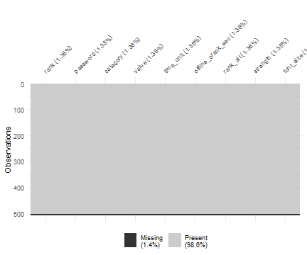

```r
library(nd.tidytuesday)
library(dplyr)
library(ggplot2)
```


## Data import and inspection

One can obtain the metadata table using `datapasta`'s R package addin and copying the table available at 


```r
meta <- data.frame(stringsAsFactors=FALSE,
                   variable = c("rank", "password", "category", "value", "time_unit",
                                "offline_crack_sec", "rank_alt", "strength", "font_size"),
                   class = c("double", "character", "character", "double", "character",
                             "double", "double", "double", "double"),
                   description = c("popularity in their database of released passwords",
                                   "Actual text of the password",
                                   "What category does the password fall in to?", "Time to crack by online guessing",
                                   "Time unit to match with value", "Time to crack offline in seconds",
                                   "Rank 2", "Strength = quality of password where 10 is highest,
                   1 is lowest,
                   please note that these are relative to these generally bad passwords", "Used to create the graphic for KIB")
)
meta <- as_tibble(meta)

pander::pander(meta)
```


----------------------------------------------------------------
     variable          class              description           
------------------- ----------- --------------------------------
       rank           double      popularity in their database  
                                     of released passwords      

     password        character    Actual text of the password   

     category        character       What category does the     
                                      password fall in to?      

       value          double        Time to crack by online     
                                            guessing            

     time_unit       character   Time unit to match with value  

 offline_crack_sec    double        Time to crack offline in    
                                            seconds             

     rank_alt         double                 Rank 2             

     strength         double     Strength = quality of password 
                                 where 10 is highest,           
                                     1 is lowest,               
                                        please note that        
                                  these are relative to these   
                                    generally bad passwords     

     font_size        double     Used to create the graphic for 
                                              KIB               
----------------------------------------------------------------

the `readr::read_csv` function gives some information on how the data was processed, with here no errors or warnings.


```r
passwords <- readr::read_csv('https://raw.githubusercontent.com/rfordatascience/tidytuesday/master/data/2020/2020-01-14/passwords.csv')
#> Parsed with column specification:
#> cols(
#>   rank = col_double(),
#>   password = col_character(),
#>   category = col_character(),
#>   value = col_double(),
#>   time_unit = col_character(),
#>   offline_crack_sec = col_double(),
#>   rank_alt = col_double(),
#>   strength = col_double(),
#>   font_size = col_double()
#> )
```

The passwords dataset has 507 rows * 9 variables. It is not tidy, if we want to use the `value` variable of online guessing we need to add the `time_unit` information to it.


```r
passwords %>% 
  glimpse()
#> Observations: 507
#> Variables: 9
#> $ rank              <dbl> 1, 2, 3, 4, 5, 6, 7, 8, 9, 10, 11, 12, 13, 1...
#> $ password          <chr> "password", "123456", "12345678", "1234", "q...
#> $ category          <chr> "password-related", "simple-alphanumeric", "...
#> $ value             <dbl> 6.91, 18.52, 1.29, 11.11, 3.72, 1.85, 3.72, ...
#> $ time_unit         <chr> "years", "minutes", "days", "seconds", "days...
#> $ offline_crack_sec <dbl> 2.17e+00, 1.11e-05, 1.11e-03, 1.11e-07, 3.21...
#> $ rank_alt          <dbl> 1, 2, 3, 4, 5, 6, 7, 8, 9, 10, 11, 12, 13, 1...
#> $ strength          <dbl> 8, 4, 4, 4, 8, 4, 8, 4, 7, 8, 8, 1, 32, 9, 9...
#> $ font_size         <dbl> 11, 8, 8, 8, 11, 8, 11, 8, 11, 11, 11, 4, 23...
```

Glimpse of the passwords :


```r
passwords %>% head() %>% pander::pander()
```


-------------------------------------------------------------------------------
 rank   password        category         value   time_unit   offline_crack_sec 
------ ---------- --------------------- ------- ----------- -------------------
  1     password    password-related     6.91      years           2.17        

  2      123456    simple-alphanumeric   18.52    minutes        1.11e-05      

  3     12345678   simple-alphanumeric   1.29      days           0.00111      

  4       1234     simple-alphanumeric   11.11    seconds        1.11e-07      

  5      qwerty    simple-alphanumeric   3.72      days           0.00321      

  6      12345     simple-alphanumeric   1.85     minutes        1.11e-06      
-------------------------------------------------------------------------------

Table: Table continues below

 
---------------------------------
 rank_alt   strength   font_size 
---------- ---------- -----------
    1          8          11     

    2          4           8     

    3          4           8     

    4          4           8     

    5          8          11     

    6          4           8     
---------------------------------


## Quality check


```r
# --- using base R function
# passwords %>% 
#   qual_fun(.)

# --- tidyverse approach
passwords %>% 
  tidy_qual() %>% 
  pander::pander()
```


----------------------------------------------------------------------------
 indic   rank   password   category   value   time_unit   offline_crack_sec 
------- ------ ---------- ---------- ------- ----------- -------------------
 n_na     7        7          7         7         7               7         

 n_nan    0        0          0         0         0               0         

 n_inf    0        0          0         0         0               0         
----------------------------------------------------------------------------

Table: Table continues below

 
---------------------------------
 rank_alt   strength   font_size 
---------- ---------- -----------
    7          7           7     

    0          0           0     

    0          0           0     
---------------------------------

The 7 missing values are the in the same rows :


```r
passwords %>% 
  filter(!complete.cases(passwords))
#> # A tibble: 7 x 9
#>    rank password category value time_unit offline_crack_s~ rank_alt
#>   <dbl> <chr>    <chr>    <dbl> <chr>                <dbl>    <dbl>
#> 1    NA <NA>     <NA>        NA <NA>                    NA       NA
#> 2    NA <NA>     <NA>        NA <NA>                    NA       NA
#> 3    NA <NA>     <NA>        NA <NA>                    NA       NA
#> 4    NA <NA>     <NA>        NA <NA>                    NA       NA
#> 5    NA <NA>     <NA>        NA <NA>                    NA       NA
#> 6    NA <NA>     <NA>        NA <NA>                    NA       NA
#> 7    NA <NA>     <NA>        NA <NA>                    NA       NA
#> # ... with 2 more variables: strength <dbl>, font_size <dbl>
```

In total those missing values represent less than 2% of the total of data.


```r
passwords %>% 
  naniar::vis_miss()
```



```r

passwords %>% 
  visdat::vis_dat()
```


## Cleaning

To fix the types, the character variables are set as factors.


```r
psw_clean <-
  passwords %>% 
  filter(complete.cases(passwords)) %>% 
  mutate_if(is.character, factor) %>% 
  tidyr::unite(data = ., col = "online_duration", value, time_unit, sep = " ", remove = FALSE) %>% 
  mutate(online_duration = lubridate::duration(num = online_duration),
         od_num = as.numeric(online_duration)
  )
```

The value and time unit are united in the `online_time` variable with seconds as unit.


```r
# summary(psw_clean)
log_df <- tibble(
  unit = c("sec", "min", "h", "day", "week", "month", "year", "10years", "100years"),
  logv = log(c( 1, 60, 3600, 24*3600, 7*24*3600, 30*24*3600, 
                365.25*24*3600, 10*365.25*24*3600, 100*365.25*24*3600) ),
  y = 0.65
)

# exp(30)/(20*365.25*24*3600)

psw_clean %>% 
  ggplot(aes(x = log(od_num), y = stat(density))) + 
  geom_histogram() +
  geom_vline(xintercept = log_df$logv, colour = "red") +
  geom_label(data = log_df, aes(x = logv, y = y, label = unit)) + # inherit.aes = FALSE,
  theme_light() + xlab("log(duration)") + ylab("Density") +
  ggtitle("Density historam of the log duration to hack passwords")
#> `stat_bin()` using `bins = 30`. Pick better value with `binwidth`.
```


## Univariate study

There are 10 unique categories and 7 unit of time. Passwords are unique individuals in this dataset.


```r
psw_clean %>% 
  summarise_if(.tbl = .,.predicate = is.factor, .funs = list("nb_u" = ~length(unique(.))) ) %>% 
  mutate(indic = "nb unique") %>% 
  select(indic, everything())
#> # A tibble: 1 x 4
#>   indic     password_nb_u category_nb_u time_unit_nb_u
#>   <chr>             <int>         <int>          <int>
#> 1 nb unique           500            10              7
```


1/3 of the passwords are names, most are actually dictionnary words.


```r
cat_stat <- psw_clean %>%
  group_by(category) %>% 
  summarise(nb = n(),
            pct = nb/nrow(psw_clean)*100) %>% 
  arrange(-nb)

cat_stat %>% 
  ggplot(aes(x = forcats::fct_reorder(.f = category, .x = pct), y = pct)) + 
  geom_col(fill = "#4F62DB") +
  geom_text(aes(y = pct + 2, label = pct), size = 4) +
  xlab("Category of passord") + ylab("Percentage") +
  ggtitle("Repartition of the passwords per categories") +
  theme_light() +
  coord_flip()
```


Nearly 70% of the passwords considered are crackable online in less than a week, 20% are guessable within a day.


```r
tu_stat <- psw_clean %>%
  group_by(time_unit) %>% 
  summarise(nb = n(),
            pct = nb/nrow(psw_clean)*100) %>% 
  arrange(-nb)

tu_stat %>% 
  ggplot(aes(x = forcats::fct_reorder(.f = time_unit, .x = pct), y = pct)) + 
  geom_col(fill = "#D91515") +
  geom_text(aes(y = pct + 2, label = pct)) +
  xlab("Time unit to crack a passord") + ylab("Percentage") +
  ggtitle("Repartition of the time unit required to crack passwords") +
  theme_light() +
  coord_flip()
```


We can look at the character type distribution in the passwords.


```r
library(stringr)

passwd_type <- psw_clean %>% 
  mutate(password = as.character(password)) %>% 
  mutate("nb_char" = nchar(password),
         num_part = purrr::map_chr( stringr::str_extract_all(string = password, pattern = "[:digit:]"),
                                    function(x) paste(x, collapse = "") ),
         nchar_num = nchar(num_part),
         
         alpha_part = purrr::map_chr( stringr::str_extract_all(string = password, pattern = "[:alpha:]"),
                                      function(x) paste(x, collapse = "") ),
         nchar_alpha = nchar(alpha_part),
         
         punct_part = purrr::map_chr( stringr::str_extract_all(string = password, pattern = "[:punct:]"),
                                      function(x) paste(x, collapse = "") ),
         nchar_punct = nchar(punct_part),
         
         lower_part = purrr::map_chr( stringr::str_extract_all(string = password, pattern = "[:lower:]"),
                                      function(x) paste(x, collapse = "") ),
         nchar_lower = nchar(lower_part),
         
         upper_part = purrr::map_chr( stringr::str_extract_all(string = password, pattern = "[:upper:]"),
                                      function(x) paste(x, collapse = "") ),
         nchar_upper = nchar(upper_part)
  )
```

The data contains passwords with numeric and alpha character. All of alpha character use lower case.


```r
passwd_type %>%
  select(dplyr::starts_with("nchar")) %>%
  base_summary() %>% 
  pander::pander()
```


-----------------------------------------------------------------
  variable     mean   var     sd    min   1q   median   3q   max 
------------- ------ ------ ------ ----- ---- -------- ---- -----
  nchar_num    0.54   2.79   1.67    0    0      0      0     9  

 nchar_alpha   5.66   3.88   1.97    0    6      6      7     8  

 nchar_punct    0      0      0      0    0      0      0     0  

 nchar_lower   5.66   3.88   1.97    0    6      6      7     8  

 nchar_upper    0      0      0      0    0      0      0     0  
-----------------------------------------------------------------

One can suspect a linear relation between the online and offline time of cracking.


```r
# passwd_type %>% View()
passwd_type %>% # glimpse()
  ggplot(aes(x = od_num, y = offline_crack_sec, colour = strength, size = factor(nb_char)) ) +
  geom_point(alpha = .1)
#> Warning: Using size for a discrete variable is not advised.
```


```r
# facet_grid("category", scales = "free")
```

This is confirmed passing to (log ,log) scaled plot. The formula obatined is 

$$log(offline) = -18.322 + 0.987 \times log(online)$$ 


```r
df_min <- passwd_type %>% transmute(x = log(od_num), y = log(offline_crack_sec))
# summary(df_min)
lm_mod <- lm(y ~ x, df_min)
# summary(lm_mod)
df_min$y_hat <- predict.lm(lm_mod, newdata = df_min)

passwd_type %>% # glimpse()
  ggplot(aes(x = log(od_num), y = log(offline_crack_sec), colour = strength, size = nb_char ) ) +
  geom_point(alpha = .1) +
  geom_line(data = df_min, aes(x, y_hat), inherit.aes = FALSE) +
  xlab("Log online time") + ylab("Log offline time") +
  ggtitle("Evolution of the log offline time depending on the log online time") +
  theme_classic()
```


